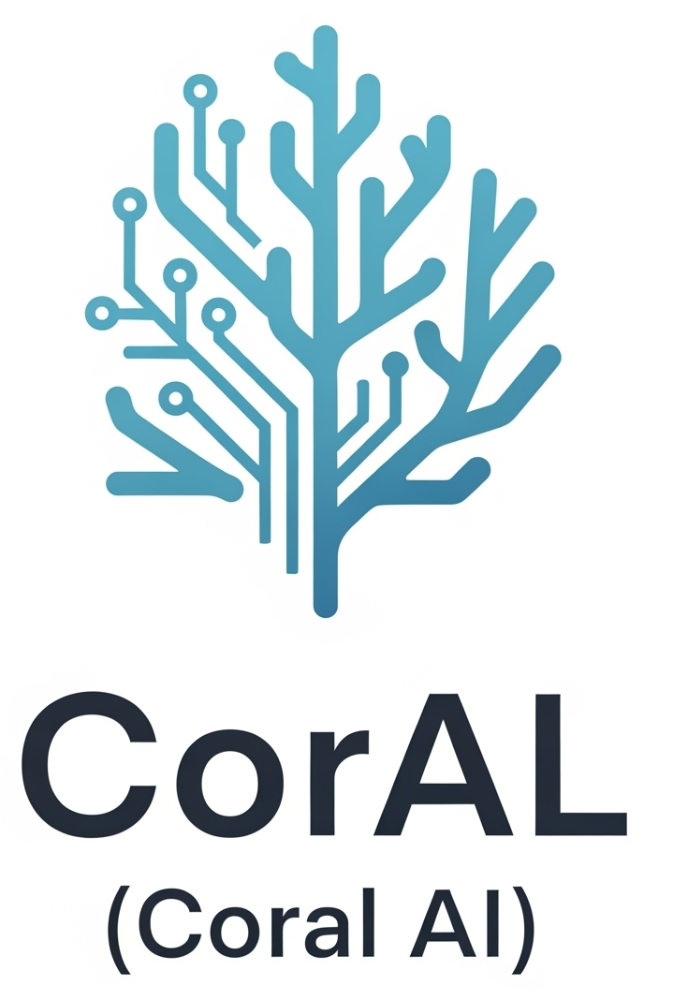

# CorAI (Coral AI)

CorAI (Coral AI) is a project focused on applying AI/ML to coral reef research, monitoring, and conservation. This repository is structured to support data science workflows, cloud deployment, documentation, and reproducible research.

### Main Folders
- **scripts/**: Python and shell scripts for data processing, model training, and automation.
- **notebooks/**: Jupyter notebooks for exploration, analysis, and prototyping.
- **cloud/**: Cloud deployment resources (e.g., Terraform, AWS, Azure, GCP configs).
- **documents/**: Project documentation, reports, and references.
- **data/**: Example datasets, data schemas, and data management scripts.
- **models/**: Pretrained models, model checkpoints, and training logs.

----------
#### Disclaimer
This repository is a scientific product and is not official communication of the National Oceanic and Atmospheric Administration, or the United States Department of Commerce. All NOAA GitHub project content is provided on an ‘as is’ basis and the user assumes responsibility for its use. Any claims against the Department of Commerce or Department of Commerce bureaus stemming from the use of this GitHub project will be governed by all applicable Federal law. Any reference to specific commercial products, processes, or services by service mark, trademark, manufacturer, or otherwise, does not constitute or imply their endorsement, recommendation or favoring by the Department of Commerce. The Department of Commerce seal and logo, or the seal and logo of a DOC bureau, shall not be used in any manner to imply endorsement of any commercial product or activity by DOC or the United States Government.

#### License
- Details in the [LICENSE.md](./LICENSE.md) file.
