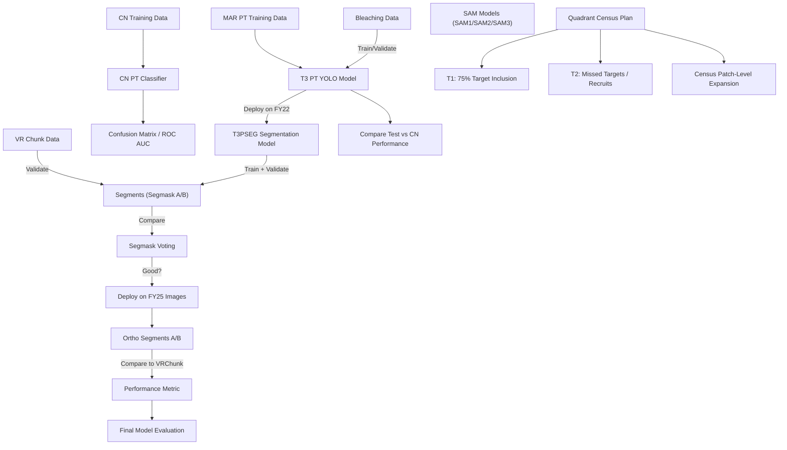
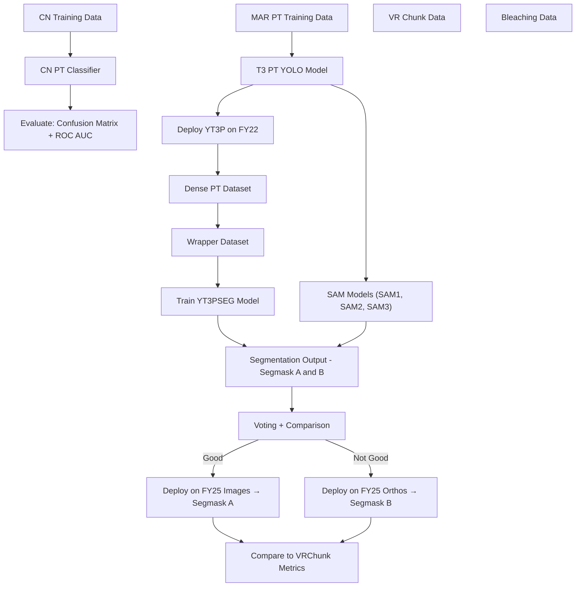
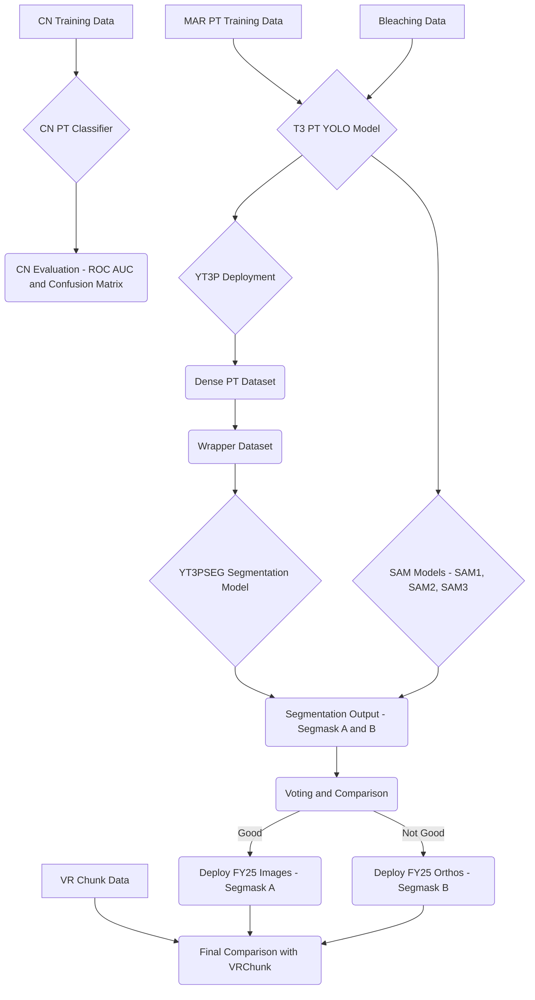

# Models
## Model Zoo
Save pretrained models, model checkpoints, and training logs here. Document model architectures and usage instructions as needed.

## Model Dev Plan

## AI/ML Workflow Plan – Steps (Right Side)

- [x] 0. MARIAN TRAIN DATA ✅ `A1`
- [x] 1. VR CHUNK DATA ✅ `A1`
- [x] 2. BLEACHING DATA ✅ `A1`
- [x] 3. BLEACHING MODEL ✅ `89%`

## Training & Deployment Workflow

1. Train T3 YOLO PT model → `T3P`
   - with T-T Split v1.7 (FY22)
   - ☐ Compare test performance to CN performance
   - Ensure no CN-trained images included

2. Deploy `YT3P` on FY22 (`PQ`)
   - → Dense PT dataset

3. Create "wrapper" dense PT dataset
   - 3.1. YT3P Dense Segmask (FY22 PQ)
   - 3.2. Validate on VRChunk (**METRIC**)

4. Train YT3PSEG Model

5. Deploy YT3PSEG on VRChunk (**METRIC**)
   - Good?
     - If ✔️:
       - 5.1 Deploy on FY25 images → generate FY25 ortho segmask A
     - If ❌:
       - 5.2 Deploy on FY25 orthos → generate FY25 ortho segmask B
       - 5.3 Compare ortho segmask A/B to VRChunk (**METRIC**)

6. All 4 SAM...

