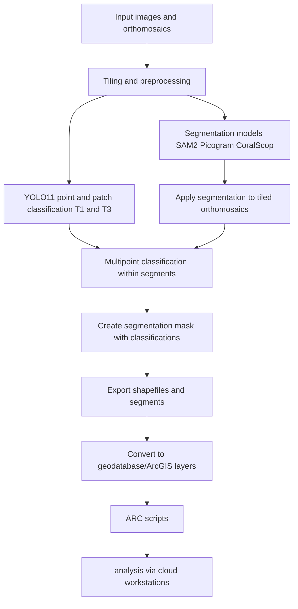
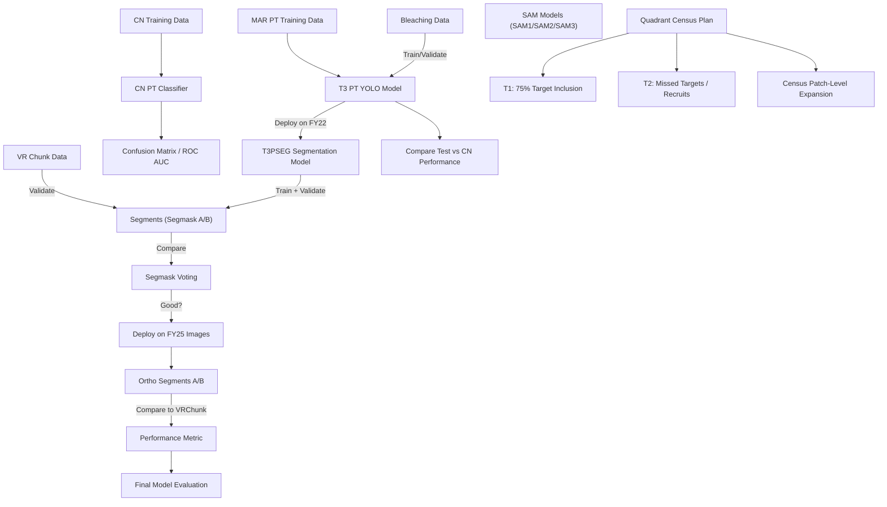
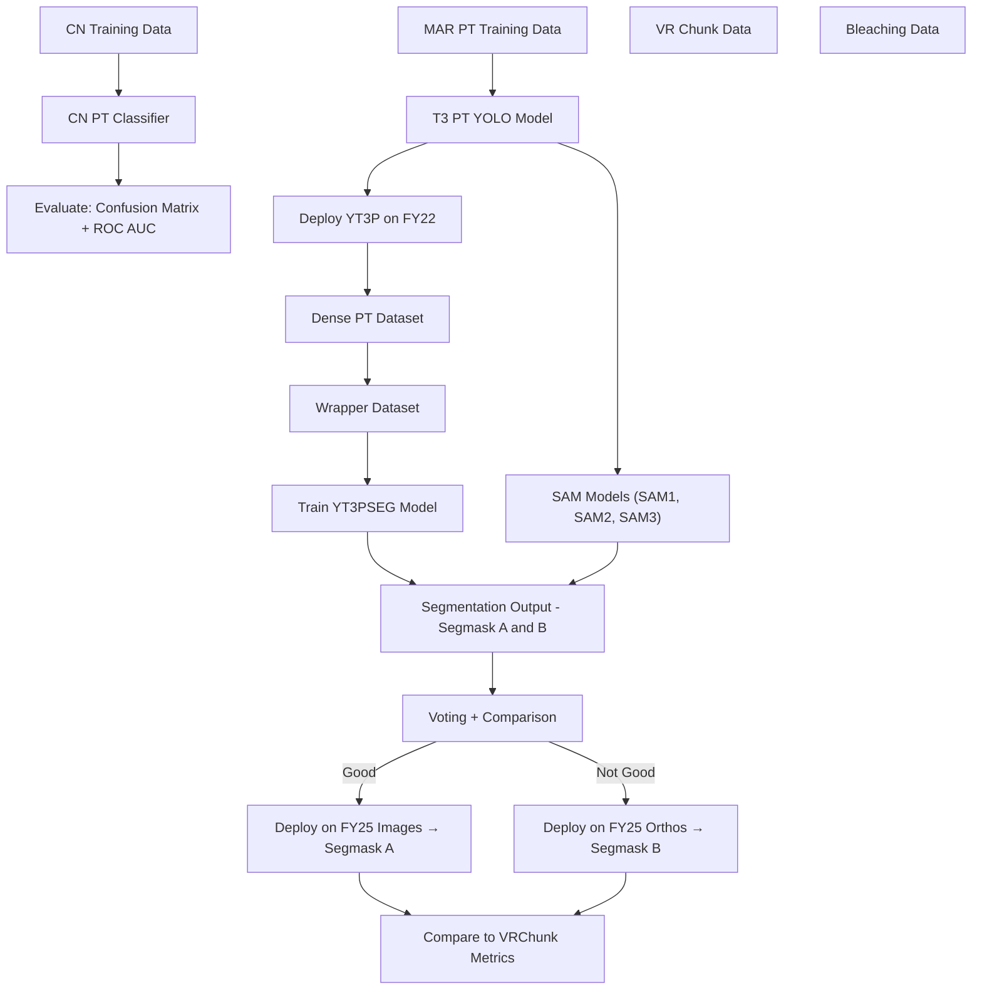
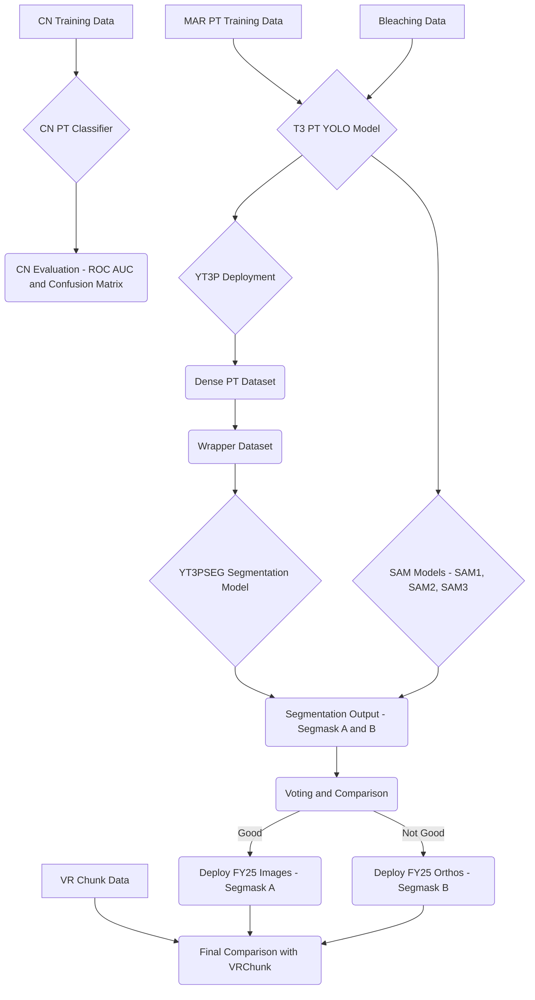

# Coral AI Model Development Pipeline

- **v0** (September 2025) Prototyping
- **v1** (FY26) Iterative Development, integration and innovation
---

## 🗓 September 2025 Breakdown (v0)

- **Sept 2–4** → Kickoff, YOLO11 classifier (T1/T3).  
- **Sept 9–12** → Segmentation model setup + tiling workflow.  
- **Sept 17–19** → Integration: feed segments into YOLO11 multipoint classifier.  
- **Sept 22–26** → Ortho-scale validation + mask-to-shapefile export.  
- **Sept 29–Oct 3** → Geodatabase + ArcGIS scripting.  

---
## 🛠 Pipeline Diagram

## Version 0 (v0)

**Focus:** Prototyping and validation of classification + segmentation workflow.  
**Timeline:** September 2025  

### Key Tasks

1. **YOLO11 Classification Model (Point/Patch)**  
   - Train YOLO11 models for Tier 1 (T1) and Tier 3 (T3) groupings of corals.  
   - Adult & Juvenile coral segmentation masks
   - using coralnet marianas v2 dataset

2. **Top Segmentation Model Implementation**  
   - Evaluate and run segmentation models:  
     - **SAM2 (Segment Anything v2)**  
     - **Picogram**  
     - **CoralScop**  
   - Benchmark performance for coral reef imagery.  

2a. **Apply Segmentation to Tiled Orthomosaics**  
   - Process large orthomosaics by tiling into manageable slices.  
   - Apply segmentation masks at ortho-scale.  

3. **Segmentation → YOLO11 Integration**  
   - Feed segmentation outputs into YOLO11.  
   - Run multipoint classification within each segment region.  

4. **Create Segmentation Mask with Classifications**  
   - Merge classification results with segmentation masks.  
   - Generate **shapefiles** linking class + segment geometry.  

5. **Export to Geodatabase & ArcGIS**  
   - Convert shapefiles into an **ESRI geodatabase**.  
   - Attach features, classes, and attributes for ArcGIS workflows.  

6. **Additional ARC Scripting**  
   - Automate tiling, data prep, shapefile conversion, and ArcGIS exports.  
   - Ensure repeatability across sites/datasets.  

---

## Version 1 (v1)

**Focus:** Iterative Development, integration and innovation. First stable integrated pipeline.  
**Timeline:** Starting October 2025  

### Planned Improvements
- Implement classification + segmentation directly on **images** (not just orthomosaics).  
- Rebuild **3D point clouds** and **orthomosaic pipelines** with integrated classification/segmentation.  
- Improve workflow automation for pilot workstation deployment.  
- Strengthen interoperability with NOAA cloud environments.  

---

## 📂 Outputs

- **YOLO11 Classifier Models** (point/patch, T1/T3).  
- **Segmentation Masks** (SAM2, Picogram, CoralScop).  
- **Classified Ortho-Scale Products** (segments → shapefiles).  
- **Geodatabase + ArcGIS-ready layers**.  
- **ARC Automation Scripts** for scaling across workstations.  

---

## ⚙️ Dependencies

- [Ultralytics YOLOv11](https://github.com/ultralytics/ultralytics)  
- [Meta Segment Anything (SAM2)](https://github.com/facebookresearch/segment-anything)  
- Picogram segmentation (internal repo)  
- CoralScop segmentation
- GDAL / Rasterio (orthomosaic tiling + merging)  
- ArcPy / ArcGIS Pro (geodatabase + shapefile workflows)  
- Python 3.10+  

### To Look Into: 
- https://github.com/Jordan-Pierce/xSAM
- https://github.com/Jordan-Pierce/CoralNet-Toolshed | Segmentation3D: Use masks and SfM to create classified 3D models
- https://www.sciencedirect.com/science/article/pii/S2352340920304856

---

## (OLD) Model Dev Plan

## AI/ML Workflow Plan – Steps (Right Side)

- [x] 0. MARIAN TRAIN DATA ✅ `A1`
- [x] 1. VR CHUNK DATA ✅ `A1`
- [x] 2. BLEACHING DATA ✅ `A1`
- [x] 3. BLEACHING MODEL ✅ `89%`

## Training & Deployment Workflow

1. Train T3 YOLO PT model → `T3P`
   - with T-T Split v1.7 (FY22)
   - ☐ Compare test performance to CN performance
   - Ensure no CN-trained images included

2. Deploy `YT3P` on FY22 (`PQ`)
   - → Dense PT dataset

3. Create "wrapper" dense PT dataset
   - 3.1. YT3P Dense Segmask (FY22 PQ)
   - 3.2. Validate on VRChunk (**METRIC**)

4. Train YT3PSEG Model

5. Deploy YT3PSEG on VRChunk (**METRIC**)
   - Good?
     - If ✔️:
       - 5.1 Deploy on FY25 images → generate FY25 ortho segmask A
     - If ❌:
       - 5.2 Deploy on FY25 orthos → generate FY25 ortho segmask B
       - 5.3 Compare ortho segmask A/B to VRChunk (**METRIC**)

6. All 4 SAM...

